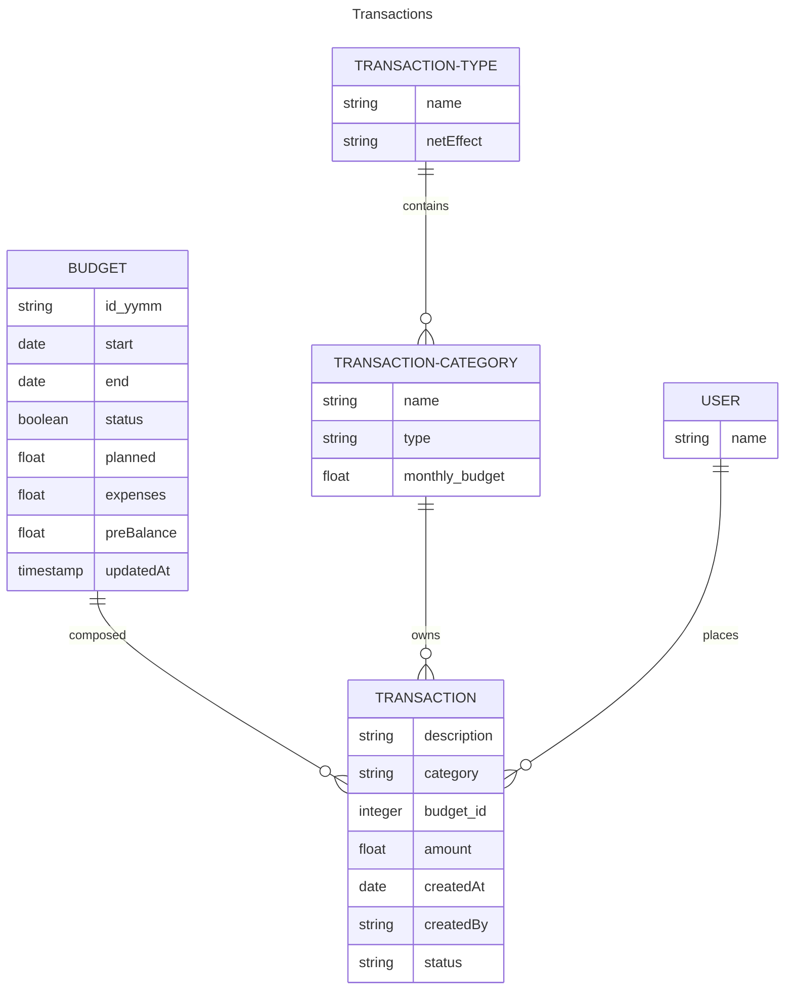
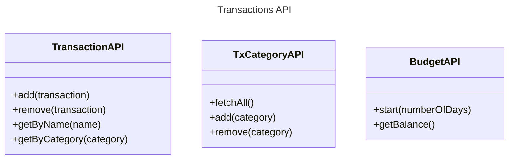

**Transaction**: Any financial activity moving money in or out of your accounts. Possible values for a transaction’s status can include:
1. Pending (it requires validation)
2. Completed 
3. Canceled

**Transaction type:**  Each transaction affects your overall budgeting by either decreasing your available funds (expense) or increasing your income (income)
**Transaction Category:**  Group similar types of financial transactions
**Budget**: refers to a financial plan that outlines expected income and expenses over a specific period, usually monthly. Only one budget is active at the time.
	- Possible statuses for a budget can include:
		1. Active
		2. Under Review
		3. Closed
	- PreBalance: refers to the balance from the month that has just passed

* Tx = Transaction

* ***Transaction API** manages the daily transactions that affect the monthly budget.
* ***TxCategoryAPI** provides a summarized report of the current status of the budget.
	- **fetchAll**: returns all the categories and the total amount of the related transactions
- **Budget API** closes the previous balance and opens a new one for the incoming period. For closing balance:
	- It gets the transaction's total amount to update the expenses field. 
	- Calculates the difference between the planned and expenses to update the balance field
	- The budget's status is updated as CLOSED
	- Creates a new record for the new period with status as ACTIVE
	- the preBalance will be set with the balance's value of the previous record.

# **Tech Stack**

APIService - Springboot
UI - ReactJS
Database - MySql

